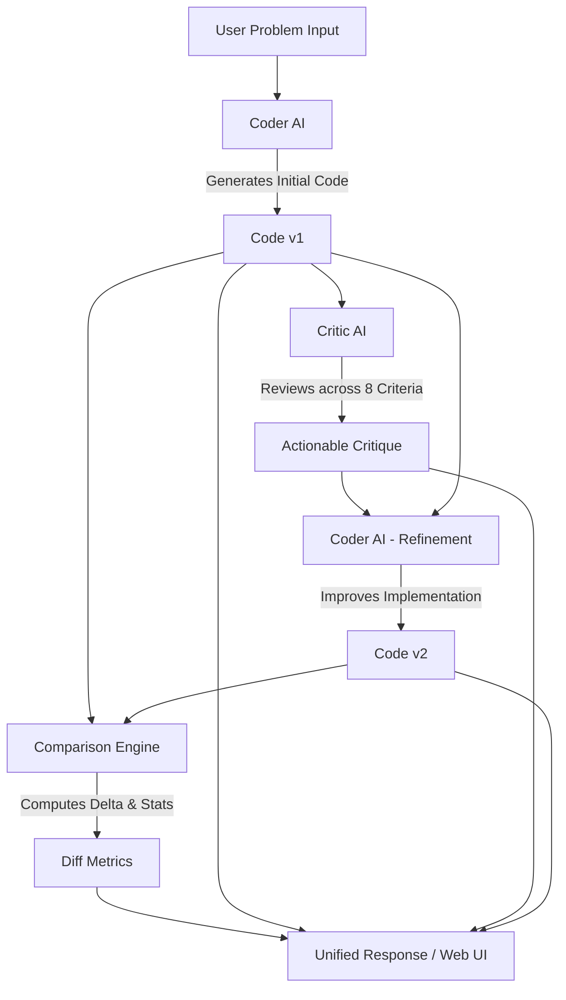

<div align="center">

# ⚡ CodeLoop AI - Autonomous AI Code Reviewer

**A collaborative dual-agent pipeline that writes, reviews, and refines code in real time.**

[](https://www.python.org/)
[](https://fastapi.tiangolo.com/)
[](https://tailwindcss.com/)
[](LICENSE)
[](https://openrouter.ai/)

[Features](#-key-features) •
[Architecture](#-architecture--workflow) •
[Quickstart](#-quickstart) •
[Web Interface](#-web-interface) •
[API Reference](#-api-reference) •
[Multi-Provider Support](#-multi-provider-support)

</div>

---

## 📖 Overview

**CodeLoop AI** is an intelligent code generation and automated peer-review platform. Instead of relying on a single one-shot LLM response, it simulates a real-world developer workflow:

1. **Coder AI (Draft)**: Analyzes the problem and generates an initial implementation (`v1`).
2. **Critic AI (Review)**: Acts as a strict senior engineer, examining `v1` against 8 quality standards (correctness, edge cases, time/space complexity, etc.).
3. **Coder AI (Refinement)**: Implements actionable recommendations from the critic to produce an optimized, production-grade solution (`v2`).
4. **Comparison Engine**: Measures line, character, and word count deltas along with code size change percentages.

---

## ✨ Key Features

- **🤖 Dual-Agent Feedback Loop**: Autonomous collaboration between specialized Coder and Critic roles.
- **🔍 Strict 8-Point Review Matrix**:
  - Correctness & logic checks
  - Edge-case handling (empty inputs, boundaries, type mismatches)
  - Time & space complexity evaluation
  - Redundant or unnecessary code detection
  - Readability, PEP 8 style, and typing
- **📊 Quantitative Diff & Metrics Engine**: Live analytics comparing code size, line delta, and character changes.
- **🌐 Built-in Interactive Web UI**: Modern dark-mode interface with syntax highlighting, sample problem chips, shortcut keys (`Ctrl + Enter`), and copy buttons.
- **💻 Interactive Terminal CLI**: Lightweight CLI mode (`cli.py`) for developers who prefer working strictly in the terminal.
- **🔌 Multi-Provider Auto-Detection**: Zero-configuration support for **OpenRouter**, **Google Gemini**, and **OpenAI**. Provider routing and model selection are auto-detected directly from your API key format.

---

## 📐 Architecture & Workflow



---

## 🚀 Quickstart

### Prerequisites
- Python 3.10 or higher
- An API key from **OpenRouter** (recommended), **Google AI Studio**, or **OpenAI**

### 1. Clone the Repository
```bash
git clone https://github.com/tarungarg26/AI-Code-Reviewer.git
cd AI-Code-Reviewer
```

### 2. Create and Activate Virtual Environment
```bash
# On Windows (PowerShell)
python -m venv venv
.\venv\Scripts\Activate.ps1

# On macOS/Linux
python3 -m venv venv
source venv/bin/activate
```

### 3. Install Dependencies
```bash
pip install -r requirements.txt
```

### 4. Configure Environment Variables
Copy the `.env.example` file to `.env`:
```bash
cp .env.example .env
```
Open `.env` and insert your API keys:
```env
CODER_API_KEY=your_api_key_here
CRITIC_API_KEY=your_api_key_here
```
> **Tip**: You can use the same key for both `CODER_API_KEY` and `CRITIC_API_KEY`, or assign separate keys/providers to each agent.

---

## 🖥️ Running the Application

### Option A: Interactive Web UI (Recommended)
Start the FastAPI server:
```bash
uvicorn backend.main:app --reload
```
Open your browser and navigate to:
👉 **[http://localhost:8000](http://localhost:8000)**

### Option B: Terminal CLI
If you prefer terminal-only usage:
```bash
python cli.py
```
Type or paste your problem statement, press `Enter` twice, and watch the agents iterate in your console.

---

## 🎨 Web Interface

The web interface is served directly by the backend at `http://localhost:8000/` and includes:
- **Problem Input Area**: Resizable textarea with <kbd>Ctrl</kbd> + <kbd>Enter</kbd> submit shortcut.
- **Quick-Start Samples**: 1-click test prompts (Two Sum, LRU Cache, Valid Parentheses).
- **Progress Tracking**: Real-time status indicator showing which agent is currently executing.
- **Side-by-Side Code View**: Synchronized panels for `v1` draft and `v2` refined code with Python syntax highlighting and instant clipboard copy.
- **Rendered Markdown Feedback**: Structured senior-engineer critique.
- **Metrics Bar**: Visual cards displaying character delta, line delta, word delta, and % change.

---

## 🔌 Multi-Provider Support

CodeLoop AI includes an intelligent provider detection engine in `backend/config.py`:

| Provider | Key Prefix Format | Default Endpoint | Default Model |
| :--- | :--- | :--- | :--- |
| **OpenRouter** | `sk-or-v1-...` | `https://openrouter.ai/api/v1` | `openrouter/auto` |
| **Google Gemini** | `AQ...` or `AIza...` | `https://generativelanguage.googleapis.com/v1beta/openai/` | `gemini-2.5-flash` |
| **OpenAI** | `sk-...` | `https://api.openai.com/v1` | `gpt-4o-mini` |

### Custom Model Configuration
You can explicitly override models and base URLs in your `.env`:
```env
CODER_MODEL=deepseek/deepseek-chat
CRITIC_MODEL=anthropic/claude-3.5-sonnet
```

---

## 📡 API Reference

### `GET /`
Serves the single-page application (`text/html`).

### `GET /api/status`
Health check endpoint.
```json
{
  "message": "CodeLoop AI is running"
}
```

### `POST /review`
Executes the full generation, review, and refinement pipeline.

#### Request Body
```json
{
  "problem": "Write a Python function to check if a string is a palindrome."
}
```

#### Response Body
```json
{
  "code_v1": "def is_palindrome(s):\n    return s == s[::-1]",
  "critic_review": "### Correctness\nFunction works for basic strings, but does not sanitize non-alphanumeric characters or casing...",
  "code_v2": "def is_palindrome(s: str) -> bool:\n    cleaned = ''.join(c.lower() for c in s if c.isalnum())\n    return cleaned == cleaned[::-1]",
  "comparison": {
    "version_1": {
      "characters": 49,
      "lines": 2,
      "words": 7
    },
    "version_2": {
      "characters": 118,
      "lines": 3,
      "words": 14
    },
    "difference": {
      "characters": 69,
      "lines": 1,
      "words": 7
    },
    "character_change_percent": 140.82
  }
}
```

### Interactive API Docs (Swagger UI)
Explore and test the API directly at:
👉 **[http://localhost:8000/docs](http://localhost:8000/docs)**

---

## 📁 Repository Structure

```
AI-Code-Reviewer/
├── backend/
│   ├── coder.py         # Coder agent prompt & execution logic
│   ├── critic.py        # Critic agent review & prompt logic
│   ├── comparison.py    # Metric & delta computation engine
│   ├── config.py        # Dynamic provider routing & credentials
│   ├── main.py          # FastAPI application, CORS, and UI router
│   └── models.py        # Pydantic schemas and input sanitization
├── frontend/
│   └── index.html       # Single-page web UI (Tailwind CSS, Highlight.js)
├── .env.example         # Template for environment variables
├── .gitignore           # Git ignore rules (protects credentials & cache)
├── cli.py               # Terminal interactive runner
├── context.md           # Deep-dive architecture & context documentation
├── requirements.txt     # Python project dependencies
└── README.md            # Project presentation and documentation
```

---

## 🤝 Contributing

Contributions, issues, and feature requests are welcome!
1. Fork the Project
2. Create your Feature Branch (`git checkout -b feature/AmazingFeature`)
3. Commit your Changes (`git commit -m 'Add some AmazingFeature'`)
4. Push to the Branch (`git push origin feature/AmazingFeature`)
5. Open a Pull Request

---

## 📄 License

Distributed under the **MIT License**. See `LICENSE` for more information.
